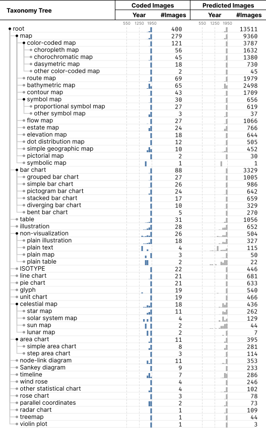

# Image Taxonomy

A taxonomy of images in the [OldVisOnline Dataset](https://github.com/oldvis/dataset).
(The images can be browsed in the [online gallery](https://oldvis.github.io/gallery/).)

## Repository Structure

This repository is structured as:
- `./images/`: The images used for developing the taxonomy.
- `./annotations.json`: The taxonomy labels assigned to the annotations.
- `./definitions.md`: The definitions of taxa in the taxonomy.
